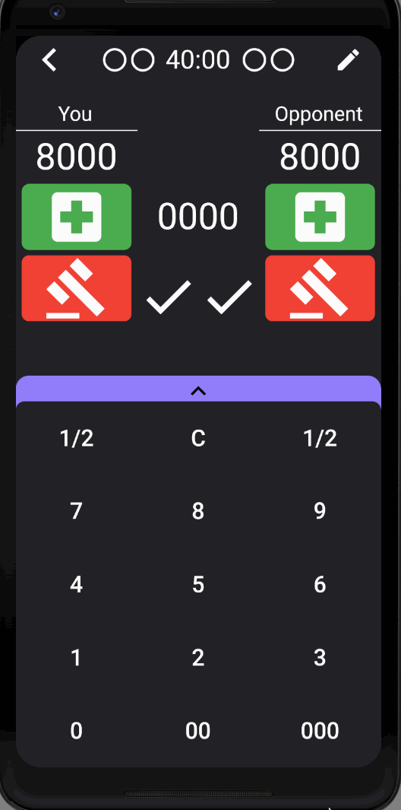

# acies

## About
Coded December 2019

acies is a modern, minimalist, feature packed, life point calculator.

This is the source code for the lite version which doesn't include match history and its data layer.

Features:
- Life point counter
- Duel history: records all events in a duel
- Notes: take any notes about a duel
- Match history: saves all matches including duel history and notes
- Die roll
- Coin flip
- Timer
- Custom player names

Here are the play store links.

<a href="https://play.google.com/store/apps/details?id=qrsd.acies">acies</a>

<a href="https://play.google.com/store/apps/details?id=qrsd.acies.lite&hl=en_US">acies lite</a>

## Design
Fully coded with flutter.

State management is handled with reactive programming using Google's BLoC Pattern with the data layer using dependency injection on a repository loading/saving entities then converted to models.

Project uses all of Dart's best practices, Effective Dart.